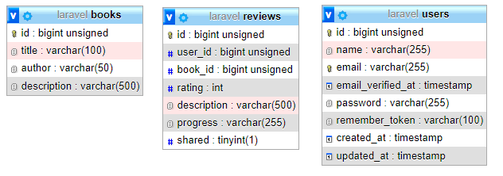

# VIZSGAREMEK
### *Az oktatási intézmény megnevezése:* Budapesti Műszaki Szakképzési Centrum Neumann János Informatikai Technikum
### *Szakképesítés neve, száma:* Szoftverfejlesztő és -tesztelő, 5-0613-12-03
### *Készítők neve, osztálya:* Kiss Kinga, Dobronay Péter, Németh Kristóf; 2/14.B
### *A benyújtás helye:* Budapest
### *A benyújtás éve:* 2023

### *Vizsgaremek címe:*
# Did You Read It

## 1. A Did You Read It célja:
A _Did You Read It?_ projekt abból a célból készült, hogy a felhasználó számára rendelkezésre álljon egy olyan szoftver amivel kényelmesen nyomon tudja követni mely könyveket olvasta már és rendszerezni tudja azokat.
## 2. Rendszerkövetelmények:

- Minimum operációs rendszer:

  - [Windows](https://docs.docker.com/desktop/install/windows-install/#system-requirements)

  - [Mac](https://docs.docker.com/desktop/install/mac-install/#system-requirements)

  - [Linux](https://docs.docker.com/desktop/install/linux-install/#system-requirements)

- Minimumon felül ajánlott hardver:
  
  - Legalább 8 GB RAM;
  - Szilárdtest-meghajtó (SSD). 

## 3. A fejlesztői környezet kialakítása:

1. Töltsük le a Did You Read It-et vagy közvetlenül a GitHub-oldaláról, vagy a Git Bash segítségével:

   - GitHubról letöltés:

     1. Látogassunk el a https://github.com/DobronayPeter/DidYouReadIt oldalra, majd a zöld `Code` gomb megnyomása után kattintsunk a `Download ZIP` opcióra
     
     2. Mentsük el egy belső meghajtón lévő* tetszőleges helyre a ZIP fájlt, majd csomagoljuk ki.
     
   - Git Bash segítségével letöltés:
     
     1. Töltsük le a Git-et az alábbi oldalról, majd telepítsük: https://git-scm.com/downloads
     
     2. Nyissuk meg a Git Bash-t, és a
        
        ```bash
        git clone https://github.com/DobronayPeter/DidYouReadIt "projektmappa"
        ```
        
        parancs segítségével -- ahol a `projektmappa` egy tetszőleges útvonal egy belső meghajtón*, ahová a projektet menteni szeretnénk -- töltsük le a projektet.

   - **\* ⚠ Figyelem:** a szoftvert belső meghajtóra mentsük, mivel ha külső (pl. USB-vel csatlakoztatott) meghajtóra mentjük, akkor egy későbbi lépésnél a Docker nem fogja tudni létrehozni a konténereket!

2. Töltsük le és telepítsük a Docker Desktop-ot, majd indítsuk el: https://docs.docker.com/get-docker/

3. Nyissunk meg egy parancssori felületet, aminek a munkakönyvtára a Did You Read It gyökérkönyvtára legyen (az előbbi `projektmappa` célmappája).

4. A gyökérkönyvtárban található `.env.example` fájl alapján hozzuk létre a `.env` fájlt, ami a szoftverhez tartozó környezeti változókat tartalmazza.
   
   - **Windows CMD:**
   
     ```bat
     copy .env.example .env
     ```
   
   - **PowerShell:**
   
     ```powershell
     Copy-Item .env.example .env
     ```
   
   - **Bash, Zsh, Fish:**
   
     ```bash
     cp .env.example .env
     ```

5. Futtassuk a
   
   ```bash
   docker compose build
   ```
   
   parancsot. Ez a `<projektmappa>/docker/php/` mappában lévő `Dockerfile`-ban lévő utasításokkal felépíti az image-eket.
   
6. Adjuk ki a
   
   ```powershell
   docker compose -f docker-compose.yml -f docker-compose.dev.yml up -d
   ```

   parancsot. Ezzel létrehozzuk a docker-compose YAML fájlok mintájára a konténereket, és a háttérben elindítjuk őket.

7. Lépjünk bele a friendly interactive shell-be (fish) a

   ```bash
   docker compose exec app fish
   ```

   parancs segítségével. Így tudjuk majd futtatni a parancsokat a konténerben közvetlenül.
   
8. Telepítsük a Composer-rel és az NPM-mel a felhasznált csomagokat, a

   ```fish
   composer install
   ```

   majd ha ez kész, az

   ```fish
   npm install
   ```

   parancs kiadásával.

9. Generáljuk le az alkalmazáskulcsot, amit a Laravel titkosításhoz fog használni:

   ```fish
   php artisan key:generate
   ```

10. Futtassuk az adatbázis-migrációkat:
    
    ```fish
    php artisan migrate
    ```

11. Lépjünk bele a `<projektmappa>/public/book-webapp` mappába

    ```fish
    cd public/book-webapp/
    ```

    majd NPM-mel telepítsük a felhasznált csomagokat:

    ```fish
    npm install
    ```

12. Indítsuk el a fejlesztői szervert a következő parancs kiadásával:
    
    ```fish
    npm run dev
    ```
     
    A Did You Read It-et mostantól el tudjuk érni a kijelzett webcímen amikor a szerver fut.

## 4. A szoftver használati bemutatása (ha lenne frontend):
1. Nyissa meg a böngészőt
2. Írja be a webcímet amelyen elérhető a webes felület (localhost + web docker konténeren jelzett portszám)
3. Jelentkezzen be
4. Kattintson a 'New Item' gombra
5. Töltse ki az űrlapot, ha a könyv még nincs az adatbázisban adjon hozzá sajátot (lokálisan lesz tárolva)
6. A könyv (és kritika) mostantól benne lesz a My List fülben
7. A community fülben más felhasználók legutóbbi publikus kritikáit nézheti meg

## 5. REST API leírása:
1. Milyen adatok elérhetőek?
   - Felhasználók nevei és id-je
   - Könyvek, kritikák lényeges adatai
   - A users és books táblákat a review vagyis felhasználók által kritika köti össze. 
      - Ezt a felhasználó állíthatja publikusra vagy privátra, a jövőben a belépett felhasználó csak a saját és mások publikus kritikáit láthatja.
   - A felhasználónak meg kell jelölnie hogy hol tart a könyvben (el szeretné olvasni, éppen olvassa, elolvasta vagy abbahagyta ha rossz volt)
2. CRUD
   - Create, Read, Update, Delete mind meg van valósítva minden táblára. A jövőben csak megfelelő jogosultságú felhasználó hajthatja végre a megfelelő műveleteket.
3. Validáció
   - Az adatok bemenetkor és módosításkor ellenőrizve vannak helyesség szempontjából
   - Módosításkor az adott rekord létezik-e már a táblában
   - Bevitelkor még nem létezik a rekord

Model | Controller | HTTP Method | Model URL | Parameters | Description
---|---|---|---|---|---
Review | ReviewController | GET | /review | | Visszaadja az összes kritikát
Review | ReviewController | GET | /review/{id} | id | Visszaad egy kritikát
Review | ReviewController | POST | /review | | Feltölt egy új kritikát
Review | ReviewController | PUT | /review/{id} | id | Módosít egy kritikát
Review | ReviewController | DELETE | /review/{id} | id | Töröl egy kritikát

Model | Controller | HTTP Method | Model URL | Parameters | Description
---|---|---|---|---|---
Book | BookController | GET | /book | | Visszaadja az összes könyvet
Book | BookController | GET | /book/{id} | id | Visszaad egy könyvet
Book | BookController | POST | /book | | Feltölt egy új könyvet
Book | BookController | PUT | /book/{id} | id | Módosít egy könyvet
Book | BookController | DELETE | /book/{id} | id | Töröl egy könyvet

Model | Controller | HTTP Method | Model URL | Parameters | Description
---|---|---|---|---|---
User | UserController | GET | /user | | Visszaadja az összes felhasználót
User | UserController | GET | /user/{id} | id | Visszaad egy felhasználót
User | UserController | POST | /user | | Feltölt egy új felhasználót
User | UserController | PUT | /user/{id} | id | Módosít egy felhasználót
User | UserController | DELETE | /user/{id} | id | Töröl egy felhasználót


## 6. Adatbázis
   - 3 tábla: users, books, reviews
   - A táblákban vannak mintaadatok
   - Backendből controllereken keresztül elérhetőek az adatok

 
## 7. Teszteredmények dokumentációja:
   - A REST API Postmannal manuálisan leteszteltük mind az 5 CRUD-ot mindegyik táblával hogy biztosítsuk a hibamentes működést.

## 8. Egyéb fejlesztési adatok
### Felhasznált anyagok:

- Laravel 9 alap projekt Docker alapon   
https://github.com/rcsnjszg/laravel-alap

- Vue 3 projekt scaffolding eszköz Vite alapon  
https://github.com/ignaczdominik/create-vue-alap-idb